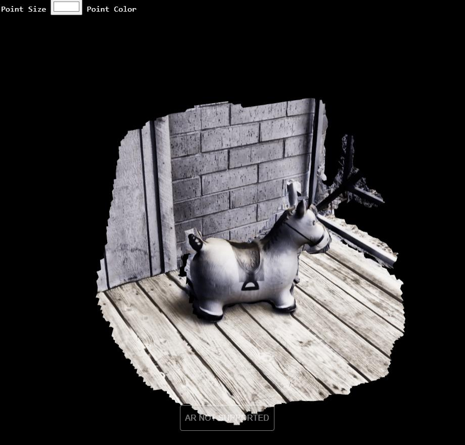
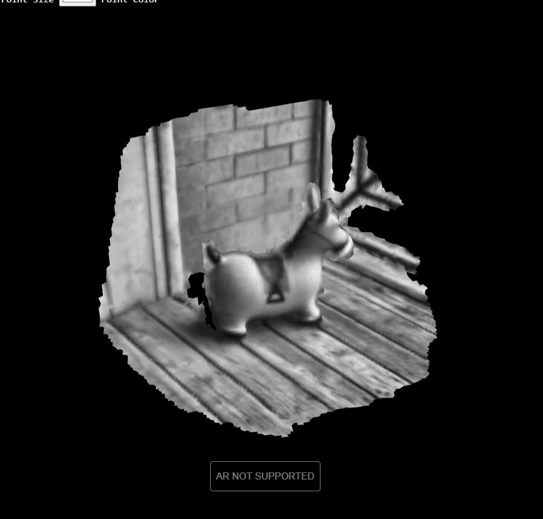
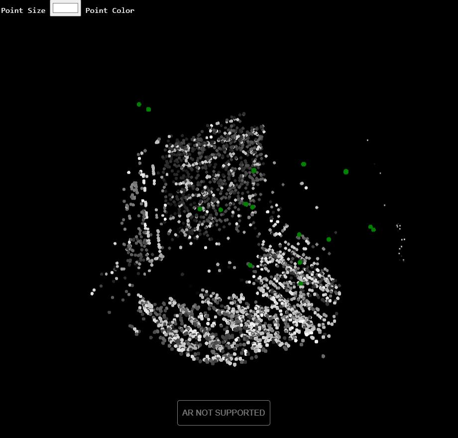

# A-Frame-Component-Web-VPS

<p float="left">

</p>


### **Description / Rationale**
This is a A-Frame component which allows to do visual positioning on the web powered by Immersal. It is a simple wrapper for Immersal's REST API, written in Three.js. The component was developed and adapted based on small tutorial provided by Takeshi Kada on using Immersal Viewer <a href="https://zenn.dev/tkada/articles/1b144d1a427148">in a local environment</a>.  

### **Instructions**

In order to use the component one should: 
1. Create a free acount on <a href="https://developers.immersal.com/"> Immersal's developer page</a>.
2. Create a map using Immersal Mapper App (available on AppStore and PlayStore; it is free).
3. Inside of Immersal's developer page take individual token and map id.
3. Then use this component. 

The component has the following attributes: 
* modelURL: { type: "string" } - the url to GLTF/GLB file, which will be loaded and localized along with pointCloud. 
* scale: { type: "vec3", default: { x: 0.5, y: 0.5, z: 0.5 } } - the scale of GLTF/GLB model
* position: { type: "vec3", default: { x: 0, y: 0, z: 0 } } - position of GLTG/GLB model
* rotation: { type: "vec3", default: { x: 0, y: 0, z: 0 } } - rotation of GLTG/GLB model
* token: { type: "string" } - token, taken from Immersal's developer page
* mapID: { type: "string" } - map id, taken from Immersal's developer page
* mapType: { type: "int", default: 0, oneOf: [0, 1] } - the type of map to display. 0 - sparse point cloud, 1- dense point cloud.
* pointCloudSize: { type: "int"} - the size of sparse point cloud, for example, 0.05.

In order to make the component work the following sample could be used:
```
<!DOCTYPE html>
<html lang="en">

<head>
    <title>A-Frame Component: Web VPS using Immersal</title>
    <meta charset="utf-8">
    <meta name="viewport" content="width=device-width, user-scalable=no, minimum-scale=1.0, maximum-scale=1.0">
    <script src="https://aframe.io/releases/1.4.1/aframe.min.js"></script>
    <!-- Immersal Configuration, component and stylesheet --> 
    <script src="js/sdkconfig.js"></script>
    <script src="js/vps-component.js" type="module"></script>
    <link type="text/css" rel="stylesheet" href="css/main.css">
</head>

<body>
<!-- This is necessary to make DOM overlays work -->
    <div id="overlay">
        <span id="lochelp">Tap to localize</span><br />
        <span id="locinfo">Successful localizations: 0/0</span>
    </div>
<!-- END -->
    <a-scene vr-mode-ui="enabled: false">
        <a-entity gltf-loader="pointCloudSize: 0.05; modelURL: example.glb; token: abcdefghijklmnopqrstuv; mapID: 99999; mapType: 0" visible="false"></a-entity>
    </a-scene>
<!-- This is necessary -->
    <div id="mapview">
        <div id="canvas-parent"></div>
    </div>
<!-- END -->
</body>
</html>
```
After entering camera mode (inside AR), direct your camera at the location you created your map and tap once on the screen. This will trigger localization of the point cloud and you should see the point cloud and/or GLTF model you loaded. Please note the counter for successful localizations at the top of the screen.  

### **Tech Stack**
The project is powered by AFrame and Three.js. 

### **Limitations**
It works on Android Chrome, and you should have the chrome://flags/#webxr-incubations set to 'enabled' if Chrome ver. is below 113. The latest chrome browsers have webxr incubations by default. iOS devices, unfortunately, are not supported for now. 
